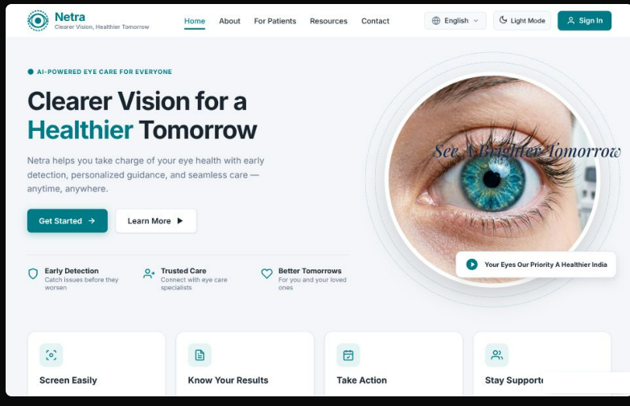
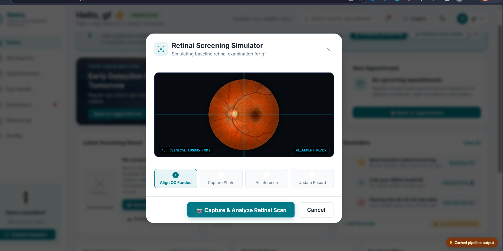
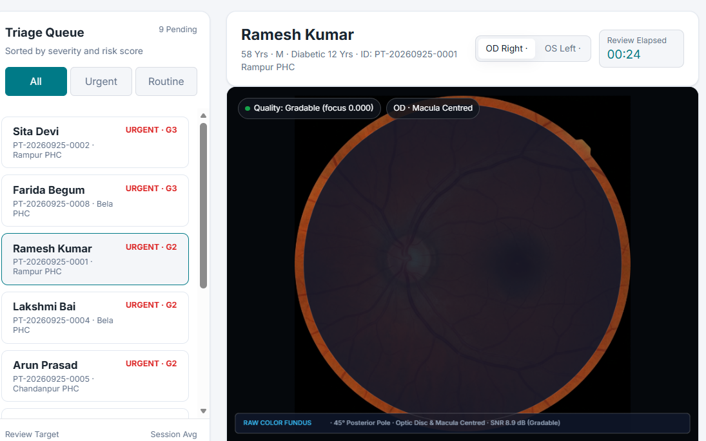
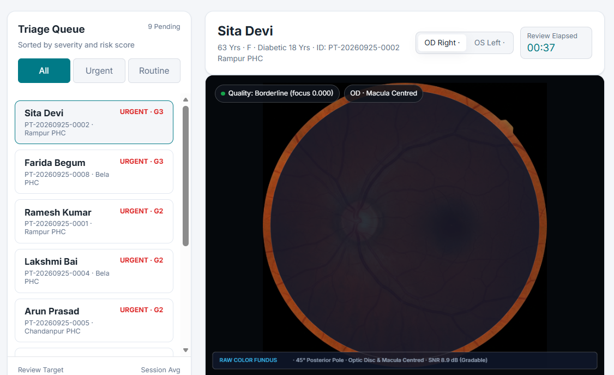

# Netra — Explainable AI for Diabetic Retinopathy Screening

**Smart India Hackathon 2026 · Problem Statement 26038 (MathWorks, MedTech)**

Netra takes a retinal fundus photograph, grades diabetic retinopathy on the
clinical **0–4 ICDR scale**, decides **refer vs. routine**, and shows the
ophthalmologist **exactly why** — so a case can be reviewed in under 30 seconds.

Built to triage at rural primary health centres, where India has ~77 million
diabetics and almost no eye specialists.

> **Prototype for research and demonstration. Not a certified medical device.**
> It is a screening aid; a qualified clinician makes every final decision.

---

## Table of contents

- [Screenshots](#screenshots)
- [What it does](#what-it-does)
- [Tech stack](#tech-stack)
- [How to run](#how-to-run)
- [Hosting it online (free)](#hosting-it-online-free)
- [Project layout](#project-layout)
- [REST API](#rest-api)
- [Data contract](#data-contract)
- [Development workflows](#development-workflows)
- [Current status & limitations](#current-status--limitations)

---

## Screenshots

### Landing page


### Patient — retinal screening
Upload a fundus image; the MATLAB pipeline runs quality gating, segmentation,
grading and explainability, then returns a full clinical result.



### Clinician — triage queue
Patients sorted by severity. Every patient carries their own fundus image,
lesion counts and calibrated confidence.



### Clinician — case review


---

## What it does

```
Fundus image
 → [1] Quality check      focus / illumination / FOV → enhance or ask for a retake
 → [2] Preprocess         crop FOV, resize, normalise, green channel
 → [3] Segment            optic disc, vessels, lesions (MA / HE / EX / NV)
 → [4] Grade              DR severity 0–4  +  referable decision
 → [5] Explain            attention map + lesion overlay + calibrated confidence + PDF
 → [6] Clinician review   Agree / Override — recorded against the patient
 ‖  Simulink models the telemedicine queue (throughput, bandwidth, reviewer capacity)
```

**Three roles**

| Role | Sign in | Sees |
|---|---|---|
| PHC operator | `phc` / `phc2026` | Register patients, run screenings |
| Clinician | `doctor` / `doctor2026` | Triage queue, case review, agree/override |
| District officer | `admin` / `netra2026` | Programme stats, all patients, drill-down |

Credentials are prototype-only, defined in [`src/datalayer/checkAuth.m`](src/datalayer/checkAuth.m).

---

## Tech stack

**The runtime pipeline is 100% MATLAB.** No Python, no Node, no external
inference server. Model *training* happens offline in Colab and is imported
as ONNX.

| Toolbox | Used for |
|---|---|
| Image Processing | CLAHE (`adapthisteq`), FOV crop, morphology (`imopen`/`imclose`/`strel`), lesion counting (`bwconncomp`, `regionprops`) |
| Computer Vision | Vessel and optic-disc segmentation, overlay rendering |
| Deep Learning | `importNetworkFromONNX`, `dlnetwork`/`dlarray`, `gradCAM`, `occlusionSensitivity` |
| Statistics & ML | Platt-scaled confidence calibration, QWK, sensitivity/specificity |
| Simulink + SimEvents | District-scale telemedicine queue model |
| MATLAB Report Generator | One-page annotated PDF per screening |
| App Designer + `uihtml` | MATLAB-native dashboard, two-way bridge via `sendEventToHTMLSource` |

**Two things worth calling out**

- **MATLAB as a REST API server.** [`src/server/netraServer.m`](src/server/netraServer.m)
  runs an HTTP server on `java.net.ServerSocket` — the JVM that ships with
  MATLAB. It serves both the web UI and the API on one port, so there is no
  CORS setup, no second process and no MATLAB Production Server licence.
- **Calibrated confidence, not raw softmax.** Platt scaling reduced expected
  calibration error from **0.176 → 0.097**. When the UI says 93%, it means it.

**Training (offline):** PyTorch on Colab → ONNX opset 11 → `importNetworkFromONNX`.

---

## How to run

### Prerequisites

- **MATLAB R2023b or newer** (developed on R2026a)
- Toolboxes: Image Processing, Computer Vision, Deep Learning, Statistics & ML,
  Simulink + SimEvents, MATLAB Report Generator
- A modern browser

### First-time setup

```matlab
cd '<path>\netra'
addpath(genpath('src')); addpath('app'); addpath('simulink')
seedDemoPatients     % 8 demo patients, each screened on a different image
```

`seedDemoPatients` **wipes and rebuilds** `netra_patients.mat` and `netra_db.mat`.

### Run it — one command

```matlab
NetraApp
```

This starts the MATLAB backend **and** opens the web UI in your browser.
One process serves both on a single port:

```
http://localhost:8090/          the web UI
http://localhost:8090/api/...   the MATLAB pipeline
```

Wait for `listening on http://localhost:8090` (~30 s — it warms the model and
database caches first). **Ctrl-C** in the MATLAB window stops it.

Port busy? `NetraApp(8091)` — any free port works.

### Try it

1. Sign in as `phc` / `phc2026`
2. Register a patient, or pick an existing one
3. Click **Capture & Analyze Retinal Scan** → choose any image from `data/samples/`
4. ~10 s later: grade, verdict, calibrated confidence, lesion table, attention map
5. Sign in as `admin` / `netra2026` for the district console

First screening after startup takes ~30 s (cold caches); after that ~10 s.

### The three entry points

| Command | What it is |
|---|---|
| `NetraApp` | **The demo.** MATLAB backend + web UI in the browser. |
| `NetraAppNative` | Original single-window MATLAB UI (`uihtml`). No browser, fully offline. |
| `netraServer(8090)` | Backend only — use when serving the UI from elsewhere. |

> Don't open the HTML files directly with `file://` — browsers block `fetch()`
> there and the app will look permanently offline. Always go through
> `http://localhost:8090`.

### Other useful commands

```matlab
exportSnapshot        % re-bake web/data/ so the hosted site works offline
syncUI                % rebuild web/ from netra_ui/ after a frontend pull
runSimulation         % Simulink sweep — reviewers needed for <24h wait
validateMessidor2     % external validation (needs data/messidor2/)
```

---

## Hosting it online (free)

MATLAB cannot run on any free hosting tier — it needs a paid licence or a
4–6 GB runtime, and free tiers give ~512 MB. So the deployment is **split**:

```
   Browser
     ├── static site ──────►  Vercel (free, always on)
     └── /api/*    ──────►  ngrok tunnel ──► your laptop ──► MATLAB
```

- **Laptop on** → live screening against the real pipeline
- **Laptop off** → the site still loads and shows **real pipeline output
  computed earlier** (`web/data/snapshot.json`), badged *"Cached pipeline
  output"*. Nothing is fabricated; live upload is simply disabled.

Two commands per session:

```matlab
NetraApp
```
```powershell
ngrok http --url=https://<your-domain>.ngrok-free.dev 8090
```

Full step-by-step, including first-time Vercel and ngrok setup, is in
**[docs/deployment.md](docs/deployment.md)**.

---

## Project layout

```
netra/
├── src/
│   ├── quality/      M-1  quality gating, FOV crop, CLAHE enhancement
│   ├── segment/      M-3  vessels, optic disc, lesions, overlays
│   ├── grade/        M-2  ICDR grading, referable decision, calibration
│   ├── explain/      M-4  attention maps, evidence view, PDF report
│   ├── datalayer/    M-5  patient registry + screening DB (.mat tables)
│   ├── server/       REST API, static serving, snapshot export, UI sync
│   └── runPipeline.m master entry point — one image in, one record out
├── app/              NetraApp (launcher) · NetraAppNative · demo seeding
├── web/              deployed frontend  (BUILD OUTPUT — see below)
├── netra_ui/         upstream frontend repo (read-only clone)
├── simulink/         SimEvents telemedicine model + parameter sweeps
├── models/           ONNX models + calibration (not in git)
├── data/samples/     sample fundus images
├── images/           per-patient overlays generated at runtime
├── reports/          generated PDFs
└── docs/             deployment guide, demo script, data contract
```

**`web/` is a build output, not a source folder.**

```
web/  =  netra_ui/  +  js/config.js + js/api.js + js/netra-bridge.js + data/
```

Never hand-edit the UI inside `web/` — it gets overwritten. Edit in
`netra_ui/`, then run `syncUI`.

---

## REST API

All JSON in / JSON out, CORS open. Served by `netraServer`.

| Method | Endpoint | Purpose |
|---|---|---|
| `GET` | `/api/health` | Liveness probe (drives the live/cached badge) |
| `POST` | `/api/login` | `{user, pass}` → role |
| `GET` | `/api/patients?q=` | Search the registry |
| `POST` | `/api/patients` | Register a patient |
| `GET` | `/api/patients/<id>` | Full dossier — profile, history, every screening |
| `POST` | `/api/screen` | `{patientId, eye, imageBase64}` → **runs the pipeline** |
| `POST` | `/api/review` | Record Agree / Override |
| `GET` | `/api/admin/snapshot` | District console payload |
| `GET` | `/api/file?p=<path>` | Serve an overlay PNG or report PDF |

Anything else is served from `web/`, so the UI and API share one origin.

---

## Data contract

A single JSON payload per screening drives the whole app — canonical copy in
[`docs/data_contract.json`](docs/data_contract.json). Pipeline and frontend
both code against it.

```jsonc
{
  "patientId": "PT-20260925-0004",
  "eye": "OD",                          // OD | OS
  "quality":  { "status": "gradable" }, // gradable | borderline | ungradable
  "result":   { "grade": 2,             // 0–4, ordinal
                "gradeLabel": "Moderate",
                "referable": true,
                "confidence": 0.93 },   // calibrated, 0–1
  "lesions":  { "maCount": 31, "heCount": 22,
                "exudateAreaPct": 1.12, "nvPresent": false },
  "routing":  "refer_specialist",       // refer_specialist | routine_followup | recapture
  "review":   { "status": "pending" }   // pending | reviewed
}
```

All probabilities are 0–1 floats; the frontend formats them as percentages.

---

## Development workflows

**Pulling frontend changes**

```matlab
cd netra_ui
!git pull
cd ..
syncUI        % rebuilds web/, re-wires the integration, idempotent
```

**Refreshing the offline snapshot** (after any pipeline change)

```matlab
exportSnapshot
```

Then commit `web/data/` — that's what the hosted site falls back to.

**Running the test suites**

```matlab
test_quality; test_segment; test_grade; test_explain
test_pipeline; test_errors; test_app; test_bundle
```

---

## Current status & limitations

Honest accounting — see [`current.md`](current.md) for the live tracker.

| Area | Status |
|---|---|
| Preprocessing / quality gating | ✅ Working, thresholds tuned on real APTOS images |
| Segmentation | ✅ Classical morphology (vessels, OD, MA/HE/EX). ONNX U-Net path stubbed. |
| Grading | ⚠️ **Classical rules baseline.** QWK ~0.44, referable sensitivity ~59% |
| Explainability | ✅ Occlusion-sensitivity attention, XAI agreement, Platt calibration |
| Data layer | ✅ Patient registry + screening DB, persists across sessions |
| Simulink | ✅ 7-block SimEvents model — a 100k/yr district needs **3 ophthalmologists** |
| Web + deployment | ✅ Live on Vercel + ngrok, with offline fallback |
| External validation | ⬜ `validateMessidor2.m` built, dataset not yet run |

**The honest headline:** grading currently runs on a **transparent classical
baseline**, not a trained CNN. `dr_grader.onnx` does not import
(external-data weights + IR 10) and needs a self-contained re-export from
Colab. The trained ResNet-50 plugs into the same interface — the evaluation
harness is built and ready.

So: **do not quote >90% sensitivity from the current build.** The target is
sensitivity >90% / specificity >85% on referable DR; the classical baseline
does not reach it, and says so.

For the same reason the heatmap is an **occlusion-sensitivity attention map**,
not Grad-CAM. Real Grad-CAM activates automatically once a CNN loads.

---

## Datasets

| Dataset | Role |
|---|---|
| APTOS 2019 | Primary grading training set (grades 0–4) |
| IDRiD | Indian; lesion masks + grades → segmentation and validation |
| DRIVE | Vessel segmentation ground truth |
| Messidor-2 | **Held out** for external validation only — never trained on |

Datasets are downloaded from Kaggle and are not committed to this repository.
